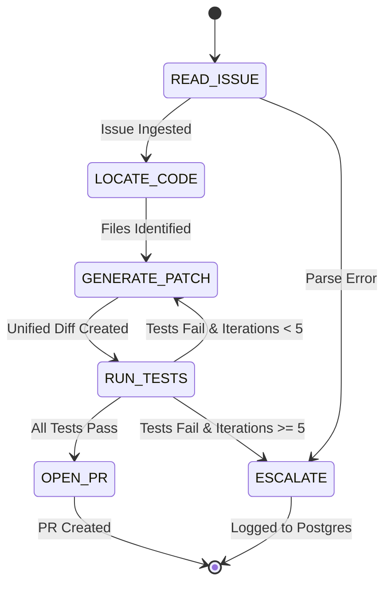

# FixForge 🛠️
> **Autonomous Bug-Fixing & Pull Request Agent** powered by an explicit Finite State Machine, Sandboxed Docker Execution, and Least-Privilege Function Calling.

[](https://github.com/A-SM20/FixForge/actions/workflows/ci.yml)
[](https://fastapi.tiangolo.com)
[](https://vitejs.dev)
[](https://tailwindcss.com)
[](https://docker-py.readthedocs.io)

---

## 🌟 Overview

**FixForge** is an end-to-end autonomous software engineering agent that resolves real-world GitHub issues. Given an issue URL and repository, FixForge:

1. **Ingests & Analyzes** the problem description and reproduction steps via GitHub API.
2. **Discovers Affected Files** using high-speed `ripgrep` regex indexing.
3. **Synthesizes Minimal Unified Diffs** targeting specific lines rather than trusting full-file LLM rewrites.
4. **Executes Test Suites** in an isolated, ephemeral Docker container (with zero network access, memory caps, and CPU quotas).
5. **Self-Corrects in a Loop** on test failures (up to 5 iterations).
6. **Opens Verified Pull Requests** upon passing tests, or cleanly escalates to human engineers with full failure logs.

---

## 🏗️ State Machine Architecture

FixForge avoids unstructured "black-box" agent loops by strictly enforcing an explicit 5-state finite state machine (FSM):



---

## 🔒 Security & Least Privilege Tool Model

The agent has **zero raw shell access**. All interactions are mediated through 5 structured function-calling tools:

| Tool | Purpose | Security & Safety Constraint |
| :--- | :--- | :--- |
| `read_file` | Read repo file contents | Path traversal sanitization (`..` stripped); output truncation (50KB cap) |
| `search_code` | Substring & regex code search | Uses fast `ripgrep` (`rg`); escaped shell patterns; 50 match limit |
| `write_patch` | Write unified diff | Validated via `git apply --check` dry-run before applying; fails loudly on bad diffs |
| `run_tests` | Run test suite in container | Ephemeral Docker container; `network_mode="none"`; 1GB RAM & 1 CPU limits; 180s timeout |
| `git_diff` | Inspect current working tree | Read-only inspection of working tree modifications |

---

## 📊 Telemetry & Cost Tracking

Every LLM inference and tool invocation is logged into PostgreSQL with full auditability:
- **Token Usage**: Prompt tokens vs completion tokens per step.
- **Dynamic Cost Tracking**: Exact USD cost calculated per model (e.g., GPT-4o input/output pricing).
- **Latency**: Precise millisecond execution time for LLM calls and sandbox commands.

---

## 🧪 SWE Benchmark Harness

FixForge includes a config-driven evaluation harness (`backend/eval/issues.yaml`) with **15 real-world issues** across top Python open-source projects (`pallets/flask`, `psf/requests`, `encode/httpx`, `pydantic/pydantic`, `fastapi/fastapi`, `pallets/click`, `Textualize/rich`, etc.).

The evaluation harness aggregates:
- **Resolve Rate (%)** (Easy, Medium, Hard breakdown)
- **Iterations to Resolve**
- **Inference Cost ($)**
- **End-to-End Latency (s)**

---

## 🚀 Quickstart

### Prerequisites
- Python 3.12+
- Node.js 20+
- Docker Desktop (for sandbox container execution)
- OpenAI API Key & GitHub Personal Access Token

### 1. Local Development Stack (Docker Compose)
```bash
# Clone the repository
git clone https://github.com/A-SM20/FixForge.git
cd FixForge

# Configure environment variables
cp backend/.env.example backend/.env
# Edit backend/.env with your OPENAI_API_KEY and GITHUB_TOKEN

# Start the full stack (Postgres + Backend API + Frontend UI)
docker compose up --build
```

### 2. Manual Development Setup

#### Backend (FastAPI)
```bash
cd backend
python -m venv .venv
source .venv/bin/activate  # Or `.venv\Scripts\activate` on Windows
pip install -r requirements.txt

# Run database migrations
alembic upgrade head

# Start FastAPI dev server
uvicorn app.main:app --reload --port 8000
```

#### Frontend (React + Vite + Tailwind)
```bash
cd frontend
npm install
npm run dev
```

Visit **`http://localhost:5173`** for the frontend UI.

---

## 🧪 Testing & CI

```bash
# Run backend test suite (42 unit + integration tests)
cd backend
pytest tests/ -v --tb=short

# Run backend linter
ruff check app/ tests/

# Run frontend build & type check
cd ../frontend
npm run build
```

---

## 🎯 Key Architectural Decisions for Interviews

1. **Why an Explicit FSM instead of ReAct/LangChain?**
   - *Determinism & Testability*: Each state is a pure-ish function `(context, db) -> (next_state, context)` that can be tested independently with mocked dependencies. No hidden framework prompts or opaque routing.
2. **Why `git apply` instead of full-file LLM rewrites?**
   - *Safety Boundary*: LLMs frequently hallucinate or drop unrelated lines when rewriting large source files. Requiring standard unified diffs and dry-running them with `git apply --check` prevents repo corruption and fails loudly with actionable syntax feedback.
3. **Why Ephemeral Docker Sandboxes with `network_mode="none"`?**
   - *Exploit Mitigation*: Untrusted code or malicious test files cannot exfiltrate environment secrets or flood external services during autonomous test runs.
4. **Why Async SQLAlchemy + Postgres for Telemetry?**
   - *Concurrency & Observability*: The agent loop is I/O intensive (LLM calls, Docker exec, GitHub API). Async I/O ensures the API server never blocks, while relational storage enables real-time joins between runs and log entries.

---

## 📄 License
MIT &copy; Ananth
